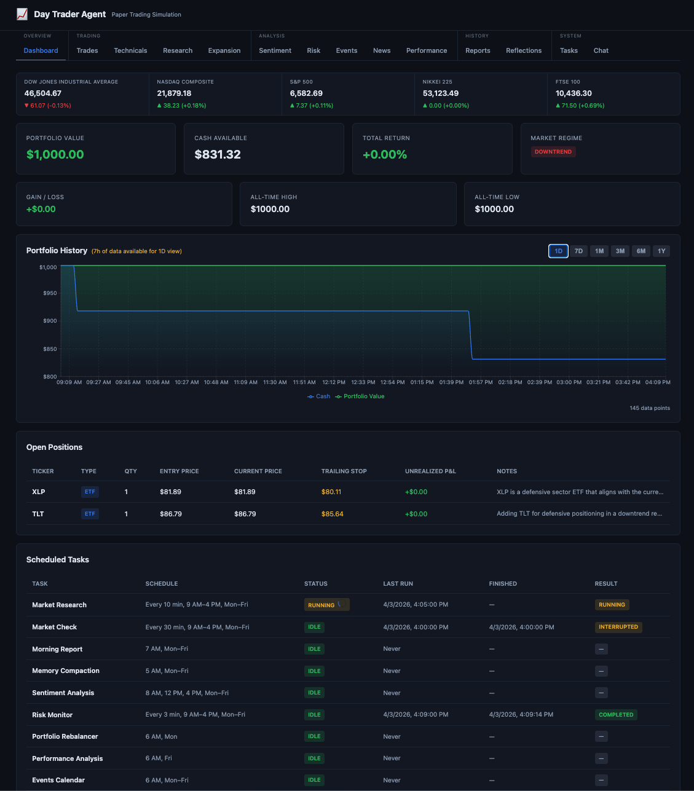

# Day Trader Agent

A fully autonomous, simulated day-trading agent that monitors global markets around the clock, executes paper trades, and learns from its own performance over time. It starts with $1,000 USD of fake money and runs entirely inside Docker.

No real money is involved. All trades are simulated and tracked on disk.



## Architecture

The project is split into two services that run together via Docker Compose:

```
┌──────────────────────────────────────────────────────────────────┐
│  trader (Python / FastAPI)                                       │
│                                                                  │
│  ┌────────────────────────────────────────────────────────────┐  │
│  │  APScheduler (19 scheduled jobs)                           │  │
│  │                                                            │  │
│  │  ── Overseas Monitors (follow-the-sun) ──────────────────  │  │
│  │  ┌──────────┐ ┌──────────┐ ┌──────────┐ ┌─────────────┐  │  │
│  │  │ Nikkei   │ │ Nikkei   │ │  FTSE    │ │  Europe     │  │  │
│  │  │  Open    │ │ Reopen   │ │  Open    │ │  Handoff    │  │  │
│  │  │(10m,7-10)│ │(15m,11-2)│ │(10m,2-5) │ │ (5:30 AM)   │  │  │
│  │  └──────────┘ └──────────┘ └──────────┘ └─────────────┘  │  │
│  │                                                            │  │
│  │  ── Core Trading Loop ───────────────────────────────────  │  │
│  │  ┌──────────┐ ┌──────────┐ ┌──────────┐ ┌─────────────┐  │  │
│  │  │ Research  │ │ Trader   │ │Sentiment │ │   Risk      │  │  │
│  │  │ (10 min) │ │ (30 min) │ │  (3x/d)  │ │  (3 min)    │  │  │
│  │  └──────────┘ └──────────┘ └──────────┘ └─────────────┘  │  │
│  │  ┌──────────┐                                              │  │
│  │  │ Momentum │                                              │  │
│  │  │  Pulse   │                                              │  │
│  │  │ (10 min) │                                              │  │
│  │  └──────────┘                                              │  │
│  │                                                            │  │
│  │  ── Intelligence & Analytics ────────────────────────────  │  │
│  │  ┌──────────┐ ┌──────────┐ ┌──────────┐ ┌─────────────┐  │  │
│  │  │ Report   │ │ Events   │ │ Market   │ │  Playbook   │  │  │
│  │  │ (7 AM)   │ │ (6 AM)   │ │ Context  │ │  (Fri)      │  │  │
│  │  └──────────┘ └──────────┘ └──────────┘ └─────────────┘  │  │
│  │                                                            │  │
│  │  ── Risk, Portfolio & Maintenance ───────────────────────  │  │
│  │  ┌──────────┐ ┌──────────┐ ┌──────────┐ ┌─────────────┐  │  │
│  │  │Rebalancer│ │Performanc│ │Expansion │ │ Compaction  │  │  │
│  │  │ (Mon)    │ │  (Fri)   │ │ (Wed)    │ │  (5 AM)     │  │  │
│  │  └──────────┘ └──────────┘ └──────────┘ └─────────────┘  │  │
│  └────────────────────────────────────────────────────────────┘  │
│                                                                  │
│  ┌────────────┐  ┌───────────────┐  ┌──────────────────────┐    │
│  │ Agent Core │  │  REST API     │  │ trader/ (persist)    │    │
│  │ Ollama LLM │──│  FastAPI :8000│──│ portfolio, logs,     │    │
│  └────────────┘  └───────────────┘  │ reports, signals     │    │
│                          ▲          └──────────────────────┘    │
└──────────────────────────┼───────────────────────────────────────┘
                           │
┌──────────────────────────┼───────────────────────────────────────┐
│  web (Next.js)           │                                       │
│  ┌───────────────────────┴─────────────────────────────────┐     │
│  │  Dashboard UI :3000  (15 pages + Learn)                 │     │
│  │  Proxies /api/* → trader:8000                           │     │
│  └─────────────────────────────────────────────────────────┘     │
└──────────────────────────────────────────────────────────────────┘
```

### Backend (`trader` service)

- **Language:** Python 3.12
- **Framework:** FastAPI + Uvicorn
- **Scheduler:** APScheduler (background, runs inside the API process)
- **LLM:** Ollama (self-hosted, configurable models)
- **Market data:** yfinance (historical + fallback prices), Finnhub `/quote` real-time quotes (ETFs, when `FINNHUB_API_KEY` is set)
- **Technical analysis:** pandas-ta (SMA, EMA, RSI, MACD, Bollinger Bands, ATR, OBV)

### Frontend (`web` service)

- **Framework:** Next.js 14 (React 18, App Router)
- **Styling:** Custom CSS (dark theme, no external UI library)
- **Rendering:** Client-side components with auto-refresh polling

## Agents

The system runs nineteen scheduled agents organized into four categories:

### Overseas Monitors (Follow-the-Sun)

| Agent | Schedule | Model | Description |
|-------|----------|-------|-------------|
| Nikkei Open Monitor | Every 10 min (7–10:30 PM ET, Sun–Thu) | Research model | Tracks Tokyo Stock Exchange morning session — Nikkei 225 level, sector leadership, yen dynamics, BOJ signals. Emits trade signals for EWJ when moves exceed threshold. |
| Nikkei Reopen Monitor | Every 15 min (11 PM–2:30 AM ET) | Research model | Tracks Tokyo afternoon session after midday break. Compares to morning, captures momentum shifts, prepares Asia summary for Europe handoff. |
| FTSE Open Monitor | Every 10 min (2:30–5:30 AM ET, Mon–Fri) | Research model | Tracks London Stock Exchange open — FTSE 100, European sector rotation, GBP/EUR dynamics, BOE/ECB signals. Emits trade signals for EWU/EWG. |
| Europe Handoff | 5:30 AM ET weekdays | Research model | Synthesizes all overnight Asia + Europe data into a single pre-market briefing. Includes pending overseas trade signals with assessment. |

### Core Trading Loop

| Agent | Schedule | Model | Description |
|-------|----------|-------|-------------|
| Market Research | Every 10 min (9 AM–4 PM) | `qwen3.5:latest` | Gathers data from 7 sources (FRED, Finnhub, SEC EDGAR, Alpha Vantage, Finviz, Reuters, Investing.com), produces structured research notes, checks stop-loss/opportunity alerts. Triggers the trader if alerts fire. |
| Market Check | Every 30 min (9 AM–4 PM) | `deepseek-r1:14b` | Full trading cycle — reads research, sentiment, risk alerts, events, technicals, regime, overseas signals, playbook, intraday reversals, momentum pulse, and scoring framework. Scores instruments with dynamic buy threshold (reduced when cash is high), runs bear-case debate on large trades, executes trades, writes reflections. |
| Morning Report | 7:00 AM weekdays | `qwen2.5:7b` | Daily summary with portfolio state, overnight global recap (Asia + Europe), trades, performance, and outlook. |

### Intelligence Agents

| Agent | Schedule | Model | Description |
|-------|----------|-------|-------------|
| Sentiment Analysis | 8 AM, 12 PM, 4 PM weekdays | `llama3.1:8b` | Scrapes news headlines via yfinance, scores each instrument as bullish/neutral/bearish with confidence levels. |
| Events Calendar | 6:00 AM weekdays | `qwen2.5:7b` | Fetches upcoming economic events (FOMC, jobs, CPI, earnings) so the trader can avoid opening positions ahead of high-impact announcements. |
| Market Context | 6:55 AM weekdays | `qwen3.5:latest` | Computes rolling 30-day portfolio arc, regime transitions, trade statistics, best/worst instruments, and correlation structure. |
| Strategy Playbook | 6:30 AM Fridays | Research model | Reads all trade history and reflections, extracts recurring patterns with empirical win rates. High-confidence patterns get more weight; failing strategies get suspended. |
| Speculation Analysis | 10 AM, 11 AM, 1 PM, 2 PM, 3 PM weekdays | Research model | Scans for asymmetric risk/reward setups the conservative trading agent might miss. Produces 1-3 speculative theses with targets, stops, reward/risk ratios, and invalidation points. Runs 5x daily to catch midday reversals. |
| Momentum Pulse | Every 10 min (10 AM–3 PM) | None (data-only) | Lightweight intraday scanner — no LLM call. Detects instruments recovering ≥60% of session range from lows. Writes signals to `momentum_pulse.json` for the hourly check to consume. |

### Risk, Portfolio & Maintenance

| Agent | Schedule | Model | Description |
|-------|----------|-------|-------------|
| Risk Monitor | Every 3 min (9 AM–4 PM) | None (rule-based) | Watches for trailing stop breaches, take-profit targets, portfolio drawdown, volatility spikes, and position correlation. Automatically executes stops and take-profits. Recalculates portfolio total value from current market prices every cycle. |
| Portfolio Rebalancer | 6:00 AM Mondays | `qwen3.5:latest` | Analyzes allocation drift, concentration risk, and cash drag. Suggests and executes rebalancing trades. |
| Expansion Analysis | 7:00 AM Wednesdays | `qwen3.5:latest` | Evaluates potential new instruments for portfolio diversification. Proposals require user approval before trading. |
| Performance Analyst | 6:00 AM Fridays | `qwen3.5:latest` | Computes win rate, profit factor, per-instrument breakdown, max drawdown, holding period analysis, and pattern detection. Updates adaptive score weights. |
| Memory Compaction | 5:00 AM weekdays | `phi3:3.8b` | Summarizes old entries to prevent unbounded file growth. Archives research, trades, and reflections into compressed history files. |

### Agent Data Flow

```
                    ┌─────────────────────────────────────────────┐
                    │         Overseas Monitors                    │
                    │                                             │
  Asia (7 PM ET)    │  Nikkei Open ──→ Nikkei Reopen             │
                    │       │                │                    │
                    │       ▼                ▼                    │
  Europe (2:30 AM)  │           FTSE Open                        │
                    │               │                             │
                    │               ▼                             │
  Handoff (5:30 AM) │       Europe Handoff ──→ Handoff Summary   │
                    │           │                                 │
                    │           ▼                                 │
                    │   Overseas Trade Signals                    │
                    └───────────┬─────────────────────────────────┘
                                │
                                ▼
Events Calendar ──→ ┐
Sentiment Agent ──→ ├──→ Trader Agent ──→ Trade Log / Portfolio
Research Agent  ──→ ├──→     ↑
Risk Monitor    ──→ ┘       │
Technical Indicators ──→    │
Market Regime ──→           │
Position Sizing ──→         │
Strategy Playbook ──→       │
Market Context ──→          │
Speculation Agent ──→       │
Momentum Pulse ──→          │
Intraday Reversals ──→      │
Performance Feedback ──→    │
                            │
Reflections ←───────────────┘
     │
     ↓
Performance Analyst ──→ Performance Reports ──→ Feedback Loop
Strategy Tracker    ──→ Strategy Scores ──→ Playbook Agent
Compaction Agent    ──→ Archived History
Rebalancer          ──→ Rebalancing Trades
Expansion Agent     ──→ Instrument Proposals ──→ User Approval
```

All schedules are configurable via environment variables using cron syntax.

**Important:** APScheduler's `from_crontab()` uses ISO weekdays (0=Mon through 6=Sun), not standard cron (0=Sun). All day-of-week values in this project follow the APScheduler convention.

**LLM request serialization:** All `call_ollama()` invocations are serialized through a global threading lock so only one LLM request is in-flight at a time. This prevents concurrent agents from saturating the GPU when their schedules overlap (e.g., Research + Market Check both firing at :30). The APScheduler thread pool is limited to 4 workers. Non-LLM jobs (Risk Monitor, Momentum Pulse) are unaffected.

### Startup Catch-Up

When the container starts mid-day (e.g., after a rebuild or restart), the scheduler checks each job: if its cron had a fire time earlier today that was missed and it hasn't run today, it schedules an immediate catch-up run. Runs are staggered by 10-second intervals to avoid overwhelming Ollama with concurrent LLM requests. Jobs whose fire time hasn't arrived yet wait for their normal schedule.

### Overseas Trade Signal Queue

When overseas monitors detect significant moves (≥1.5% by default) in international ETFs (EWJ, EWU, EWG), they emit structured trade signals to `overseas_signals.json`. Each signal includes:

- **Direction:** bullish or bearish
- **Magnitude:** the percentage move that triggered the signal
- **Driver:** one-sentence explanation of the fundamental cause
- **Urgency:** "high" for moves ≥3% (double the threshold), "normal" otherwise
- **Suggested action:** optional BUY/SELL hint for high-urgency signals

The U.S. trading agent consumes pending signals during its next hourly check, evaluating them through the standard scoring framework. Signals inform but do not bypass score thresholds. Stale signals are auto-pruned after 14 hours.

### Exchange Calendar & DST Awareness

The system maintains holiday calendars for JPX (Tokyo), LSE (London), and NYSE (New York) for 2026–2027. Overseas monitors skip runs on exchange holidays. DST transition detection warns when U.S. or UK clock changes may cause cron schedule misalignment with actual exchange times.

## LLM Models

The agent uses multiple models for different tasks, balancing quality vs. speed:

| Role | Default Model | Used By |
|------|--------------|---------|
| Trader | `deepseek-r1:14b` | Market check (trading decisions, deep reasoning) |
| Research / Analysis | `qwen3.5:latest` | Research, rebalancer, performance, expansion, market context |
| Overseas / Playbook | `qwen3.5:latest` (or `OVERSEAS_MODEL` / `PLAYBOOK_MODEL` override) | Nikkei monitors, FTSE monitor, Europe handoff, strategy playbook |
| Intelligence | `llama3.1:8b` / `qwen2.5:7b` | Sentiment (`llama3.1:8b`), events (`qwen2.5:7b`), morning report (`qwen2.5:7b`) |
| Summarization | `phi3:3.8b` | Memory compaction |

The risk monitor is purely rule-based and does not call the LLM.

### Confidence-Gated Temperature

The trading agent's LLM temperature adapts based on the strategy playbook:
- **T=0.1** when high-confidence patterns exist (≥65% win rate, 8+ trades) — exploit known edges
- **T=0.3** (default) for mixed history
- **T=0.6** when no applicable patterns exist — explore more freely in novel conditions

## Technical Analysis

The agent computes the following technical indicators for every tradeable instrument:

| Indicator | Parameters | Usage |
|-----------|-----------|-------|
| SMA | 20, 50, 200-period | Trend direction, support/resistance, golden/death cross detection |
| EMA | 12, 26-period | Short-term trend, MACD components |
| RSI | 14-period | Overbought/oversold (>70 / <30) |
| MACD | 12, 26, 9 | Momentum with signal line and histogram |
| Bollinger Bands | 20-period, 2 std dev | Volatility envelope, mean reversion signals |
| ATR | 14-period | Volatility measure, used for stop-loss and position sizing |
| OBV | 10-day slope | On-Balance Volume trend: ACCUMULATING / DISTRIBUTING / NEUTRAL — detects smart-money divergence from price |
| Volume Ratio | Current / 20-day avg | Unusual volume detection |
| Rate of Change | 20-day | Momentum confirmation |
| VIX Term Structure | VIX vs VIX3M | Classifies as NORMAL / FLAT / MILDLY_INVERTED / INVERTED — inversion signals acute near-term fear |
| Correlation Matrix | 30-day pairwise returns | Flags high-correlation pairs (|r| ≥ 0.85) as concentration risk |

Indicators are fetched from 1 year of daily history via yfinance to ensure enough data for SMA 200.

## Market Regime Detection

The system classifies the current market into one of six regimes, stored in `regime.json`:

| Regime | Conditions | Trading Adjustments |
|--------|-----------|-------------------|
| STRONG_UPTREND | SPY above SMA 50 & 200, golden cross, ROC > 3% | Full position sizes (25%), favor cyclicals (XLK, XLF, XLE) |
| UPTREND | SPY above SMA 50 & 200, positive ROC | Full position sizes, favor buying dips |
| SIDEWAYS | Mixed signals | Reduce max position to 15%, favor mean reversion |
| DOWNTREND | SPY below SMA 50 & 200, negative ROC | Reduce max position to 12%, favor cash and defensives (XLU, XLP, TLT, SHY, GLD), regime multiplier 0.7× |
| STRONG_DOWNTREND | SPY below SMA 50 & 200, death cross, ROC < -3% | Reduce max position to 10%, tighten stops |
| HIGH_VOLATILITY | VIX > 30 | Reduce max position to 10%, widen stops to 2.5x ATR, favor safe havens |

Regime detection uses: SPY price vs SMA 50/200, golden/death cross, RSI, VIX level, and 20-day rate of change.

**Sector divergence override:** Regime bias is a default, not a veto. If an instrument is in a sustained multi-session uptrend while SPY is falling (e.g., energy rallying on supply constraints during a broad market decline), the agent evaluates it on its own merits rather than applying the regime's cyclical penalty.

## Risk Management

### Rule-Based Controls
- Regime-adjusted max position size (25% in uptrends, 10–15% in downtrends/volatility)
- Fractional shares supported — positions are sized by dollar amount, not whole shares, so percentage-based limits work correctly at any portfolio size
- Configurable stop-loss threshold (default: 3% drop from entry)
- Configurable opportunity threshold (default: 2% intraday surge)
- Volatility alert threshold (default: 2.5% intraday range)
- Portfolio drawdown alert (default: 5% from all-time high)
- Correlation detection when all positions move in the same direction

### Trailing Stops & Take-Profit (Automatic)
- **Initial stop-loss:** Entry price minus 1.5× ATR, set when a position is opened
- **Trailing stop:** Highest price since entry minus 2× ATR (regime-adjusted), ratchets up only
- **Partial take-profit:** Automatically sells 50% of a position when up 5% from entry
- **Full take-profit:** Automatically sells the remaining position when up 8% from entry
- Stop and target levels are stored in `portfolio.json` alongside each position
- The risk monitor checks and executes these every 3 minutes during market hours

### Volatility-Scaled Position Sizing
- Position size = `(risk_budget / ATR)` where risk budget = 2% of portfolio value per trade
- Volatile instruments automatically get smaller positions, stable instruments get larger ones
- A regime multiplier scales the risk budget (1.0× in uptrends, 0.7× in downtrends, 0.5× in strong downtrends/high volatility)
- Capped at the regime-adjusted max position percentage

### Structured Scoring Framework
Before any trade, the LLM must score each instrument on six dimensions (-2 to +2 each):

| Dimension | Signal Sources |
|-----------|---------------|
| Trend | Moving average alignment (SMA 20/50/200), direction |
| Momentum | RSI, MACD histogram, 20-day rate of change |
| Sentiment | News headline sentiment from the sentiment agent |
| Risk/Reward | Distance to Bollinger Bands, ATR-based targets |
| Event Risk | Penalty (-2 to 0) for upcoming high-impact events |
| Sector Divergence | Whether the instrument is moving independently of the broad market (-1 to +2) |

- **BUY** only when composite score > +3 (or > +2 when cash exceeds 70% of portfolio)
- **SELL** (beyond automatic stops) only when composite score < -3
- **HOLD** when score is between -3 and the active buy threshold
- **Speculative BUY** when a Speculation Agent opportunity aligns with analysis, has reward/risk ≥ 2.0, and composite score > +2 (max 5% position)

Thresholds are configurable via `SCORE_BUY_THRESHOLD`, `SCORE_SELL_THRESHOLD`, `SCORE_BUY_THRESHOLD_HIGH_CASH`, and `SCORE_BUY_THRESHOLD_SPECULATIVE`. The dynamic buy threshold activates automatically when cash exceeds `HIGH_CASH_PCT` (default 70%). Adaptive per-instrument weights are learned from trade outcomes and applied to the composite calculation.

### Hypothesis Tracking
All BUY trades require structured hypothesis fields:
- **Hypothesis:** What must be true for this trade to work
- **Falsified by:** What would prove the hypothesis wrong
- **Confidence:** High / Medium / Low
- **Horizon:** Expected timeframe (e.g., "2-4 sessions")

After a position is closed, the reflection explicitly evaluates whether the hypothesis was validated or falsified.

### Adversarial Bear-Case Debate
For BUY trades exceeding 5% of portfolio value (configurable via `BEAR_CASE_THRESHOLD_PCT`), a skeptical risk-analyst agent argues the strongest case against the trade before execution. The bear case is appended to the trade's reasoning in the log.

### Quantitative Feedback Loop
The performance analyst generates per-trade stats fed back into the trading prompt:
- Win rate, average win/loss %, profit factor
- Average holding period for wins vs losses
- Best and worst trades, last 5 closed trades with outcomes
- Pattern detection (e.g., "You tend to sell winners too early and hold losers too long")
- Closed trade reflections compare predicted outcome vs actual outcome

### Portfolio vs Benchmark
Every trading cycle includes a portfolio-level comparison against SPY buy-and-hold over the same time period (`benchmark.py`). Metrics include:
- Portfolio return vs SPY return (alpha)
- Average cash allocation (cash drag)
- Annualized Sharpe-like ratio (risk-adjusted return)

When the portfolio underperforms the benchmark, concrete suggestions are injected into the prompt (e.g., "UNDERPERFORMING BENCHMARK: alpha -2.3%, deploy more capital"). The trading agent is instructed to address benchmark underperformance explicitly in its analysis. Available via `GET /api/benchmark`.

### Strategy Tracking & Playbook
Every trade is classified into one of 9 strategy categories (momentum_continuation, sector_rotation, mean_reversion, sector_divergence, contrarian_breakout, event_catalyst, vix_spike_rotation, stop_management, take_profit). The system tracks win/loss/neutral counts and win rate per strategy. Strategies with ≥10 trades and <35% win rate are automatically suspended and flagged in the trading prompt.

## Tradeable Instruments

The agent trades a diversified universe of 20 ETFs across equities, sectors, bonds, and commodities:

### Core Broad-Market ETFs

| Ticker | Type | Tracks |
|--------|------|--------|
| SPY | ETF | S&P 500 |
| QQQ | ETF | NASDAQ-100 |
| DIA | ETF | DOW Jones Industrial Average |

### International ETFs

| Ticker | Type | Tracks |
|--------|------|--------|
| EWJ | ETF | Japan (Nikkei proxy) |
| EWU | ETF | United Kingdom (FTSE proxy) |
| EWG | ETF | Germany (DAX proxy) |

### Sector ETFs

| Ticker | Type | Tracks | Category |
|--------|------|--------|----------|
| XLK | ETF | Technology Select Sector | Cyclical |
| XLF | ETF | Financial Select Sector | Cyclical |
| XLE | ETF | Energy Select Sector | Cyclical |
| XLV | ETF | Health Care Select Sector | — |
| XBI | ETF | S&P Biotech | High Beta |
| XLI | ETF | Industrial Select Sector | Cyclical |
| XLP | ETF | Consumer Staples Select Sector | Defensive |
| XLU | ETF | Utilities Select Sector | Defensive |

### Bond ETFs

| Ticker | Type | Tracks |
|--------|------|--------|
| TLT | ETF | 20+ Year Treasury Bond (long duration) |
| SHY | ETF | 1-3 Year Treasury Bond (short duration, safe haven) |
| AGG | ETF | US Aggregate Bond (broad fixed income) |

### Commodity ETFs

| Ticker | Type | Tracks |
|--------|------|--------|
| GLD | ETF | Gold (inflation hedge, safe haven) |
| SLV | ETF | Silver (precious metal, industrial) |
| USO | ETF | United States Oil Fund (crude oil) |

**Sector rotation strategy:** In downtrends, the agent favors defensive sectors (XLU, XLP) and bonds (TLT, SHY). In uptrends, it favors cyclical sectors (XLK, XLF, XLE). In high volatility, it favors safe havens (GLD, TLT, SHY).

Additional instruments can be added through the expansion proposal process (the expansion agent suggests, user approves).

Monitored indices: DOW Jones (^DJI), NASDAQ Composite (^IXIC), S&P 500 (^GSPC), Nikkei 225 (^N225), FTSE 100 (^FTSE).

## Data Files

All persistent state lives in the `trader/` directory, which is volume-mounted from the host:

| File | Purpose |
|------|---------|
| `portfolio.json` | Current portfolio state (cash, positions, totals, trailing stops, take-profit levels) |
| `regime.json` | Current market regime classification and parameters |
| `trade_log.md` | Append-only log of every trade and hold decision with hypothesis fields |
| `reflections.md` | Agent self-assessments after closed trades and hourly cycles |
| `research.md` | Rolling research notes from the research agent |
| `sentiment.md` | News sentiment scores per instrument |
| `risk_alerts.md` | Risk monitor alert history (including auto-executed trailing stops and take-profits) |
| `performance.md` | Weekly quantitative performance reports |
| `events.md` | Rolling economic events calendar (overwritten daily) |
| `market_research.json` | Machine-readable multi-source research report |
| `market_brief.md` | Human-readable market research brief |
| `nikkei_monitor.md` | Nikkei/Asia overnight monitor entries |
| `ftse_monitor.md` | FTSE/Europe monitor entries |
| `handoff_summary.md` | Consolidated Asia + Europe pre-market briefing |
| `overseas_signals.json` | Overseas trade signal queue (pending and evaluated signals) |
| `playbook.md` | Strategy playbook with empirical patterns and win rates |
| `market_context.md` | Rolling 30-day market context summary |
| `strategy_scores.json` | Per-strategy win/loss tracking and suspension status |
| `speculation.md` | Speculative opportunity theses from the speculation agent |
| `momentum_pulse.json` | Latest intraday momentum pulse scan results (reversal signals) |
| `expansion_proposals.json` | Pending/approved/rejected expansion proposals |
| `approved_instruments.json` | User-approved instruments beyond the core set |
| `portfolio_history.json` | Portfolio value snapshots for charting (total value, cash, per-position market values) |
| `task_history.json` | Scheduled task execution history |
| `reports/YYYY-MM-DD_report.md` | Daily morning reports |
| `reports/YYYY-MM-DD_research.md` | Daily research snapshots |
| `reports/YYYY-MM-DD_rebalance.md` | Weekly rebalance reports |
| `reports/YYYY-MM-DD_performance.md` | Weekly performance reports |
| `reports/YYYY-MM-DD_events.md` | Daily events calendar snapshots |
| `research_history.md` | Compacted daily research digests (created by compaction) |
| `trade_history.md` | Compacted monthly trade roll-ups (created by compaction) |
| `lessons.md` | Distilled trading lessons extracted from reflections (created by compaction) |

### Position Schema in portfolio.json

Each position includes stop-loss and take-profit tracking:

```json
{
  "ticker": "SPY",
  "instrument_type": "ETF",
  "quantity": 2,
  "entry_price": 512.40,
  "entry_date": "2026-04-03T10:00:00",
  "current_price": 514.10,
  "unrealized_pnl": 3.40,
  "notes": "Entered on momentum following strong open.",
  "initial_stop": 498.20,
  "trailing_stop": 502.50,
  "highest_since_entry": 516.80,
  "take_profit_partial_hit": false
}
```

## Memory Compaction

To prevent unbounded file growth, a compaction agent runs daily at 5 AM and:

1. **Research:** Summarizes old research entries into daily digests in `research_history.md`, keeps only the last N entries in `research.md`
2. **Trade log:** Rolls up entries older than the retention period into monthly summaries in `trade_history.md`
3. **Reflections:** Distills old reflections into durable lessons in `lessons.md`, deduplicating against existing lessons

## Getting Started

### Prerequisites

- Docker and Docker Compose
- An Ollama instance with the required models pulled:
  ```bash
  ollama pull deepseek-r1:14b
  ollama pull qwen3.5:latest
  ollama pull qwen2.5:7b
  ollama pull llama3.1:8b
  ollama pull phi3:3.8b
  ```

### Configuration

Copy the example environment file and configure your Ollama URL and optional API keys:

```bash
cp .env.example .env
# Edit .env with your Ollama host URL and any API keys
```

All configuration is done via environment variables in `docker-compose.yml` (which reads from `.env`):

```yaml
environment:
  - OLLAMA_BASE_URL=${OLLAMA_BASE_URL:-http://host.docker.internal:11434}
  - TRADER_MODEL_NAME=deepseek-r1:14b
  - RESEARCH_MODEL=qwen3.5:latest
  - REPORT_MODEL=qwen2.5:7b
  - SENTIMENT_MODEL=llama3.1:8b
  - EVENTS_MODEL=qwen2.5:7b
  - EXPANSION_MODEL=qwen3.5:latest
  - COMPACTION_MODEL=phi3:3.8b
  - TEMPERATURE=0.3
  # Timeouts
  - RESEARCH_TIMEOUT=600
  - EVENTS_TIMEOUT=600
  - PERFORMANCE_TIMEOUT=900
  - REPORT_TIMEOUT=600
  # Overseas monitors (APScheduler: 0=Mon..6=Sun)
  - NIKKEI_OPEN_CRON=*/10 19-22 * * 6,0-3
  - NIKKEI_REOPEN_CRON=*/15 23 * * 6,0-3
  - NIKKEI_REOPEN_LATE_CRON=*/15 0-2 * * 0-4
  - FTSE_OPEN_CRON=*/10 2-5 * * 0-4
  - EUROPE_HANDOFF_CRON=30 5 * * 0-4
  # Core trading loop
  - HOURLY_CRON=0,30 9-16 * * 0-4
  - RESEARCH_CRON=5/10 9-16 * * 0-4
  - MORNING_REPORT_CRON=0 7 * * 0-4
  # Intelligence agents
  - SENTIMENT_CRON=0 8,12,16 * * 0-4
  - EVENTS_CRON=0 6 * * 0-4
  - MARKET_CONTEXT_CRON=55 6 * * 0-4
  - PLAYBOOK_CRON=30 6 * * 4
  # Risk & portfolio
  - RISK_MONITOR_CRON=*/3 9-16 * * 0-4
  - REBALANCER_CRON=0 6 * * 0
  # Analytics & maintenance
  - PERFORMANCE_CRON=0 6 * * 4
  - EXPANSION_CRON=0 7 * * 2
  - COMPACTION_CRON=0 5 * * 0-4
  # Risk thresholds
  - STOP_LOSS_PCT=3.0
  - OPPORTUNITY_PCT=2.0
  - BEAR_CASE_THRESHOLD_PCT=5.0
  - OVERSEAS_SIGNAL_THRESHOLD_PCT=1.5
  - OVERSEAS_SIGNAL_MAX_AGE_HOURS=14
  # Scoring thresholds
  - SCORE_BUY_THRESHOLD=3
  - SCORE_SELL_THRESHOLD=-3
  # Dynamic thresholds (proactive trading)
  - SCORE_BUY_THRESHOLD_HIGH_CASH=2
  - HIGH_CASH_PCT=70.0
  - SCORE_BUY_THRESHOLD_SPECULATIVE=2
  - SPECULATION_MAX_POSITION_PCT=0.05
  - MOMENTUM_REVERSAL_RECOVERY_PCT=60.0
  - TZ=America/New_York
```

### Running

```bash
docker compose up -d
```

- Backend API: http://localhost:8000
- Web dashboard: http://localhost:3000

### Running Individual Tasks

The entrypoint supports running one-off tasks:

```bash
# Overseas monitors
docker compose run --rm trader nikkei_open
docker compose run --rm trader ftse_open
docker compose run --rm trader europe_handoff

# Core trading
docker compose run --rm trader hourly
docker compose run --rm trader research
docker compose run --rm trader report

# Intelligence
docker compose run --rm trader sentiment
docker compose run --rm trader events

# Risk & portfolio
docker compose run --rm trader risk
docker compose run --rm trader rebalance

# Analytics & maintenance
docker compose run --rm trader performance
docker compose run --rm trader compact
docker compose run --rm trader expansion
docker compose run --rm trader playbook
docker compose run --rm trader market_context

# Standalone scheduler (no API)
docker compose run --rm trader scheduler
```
